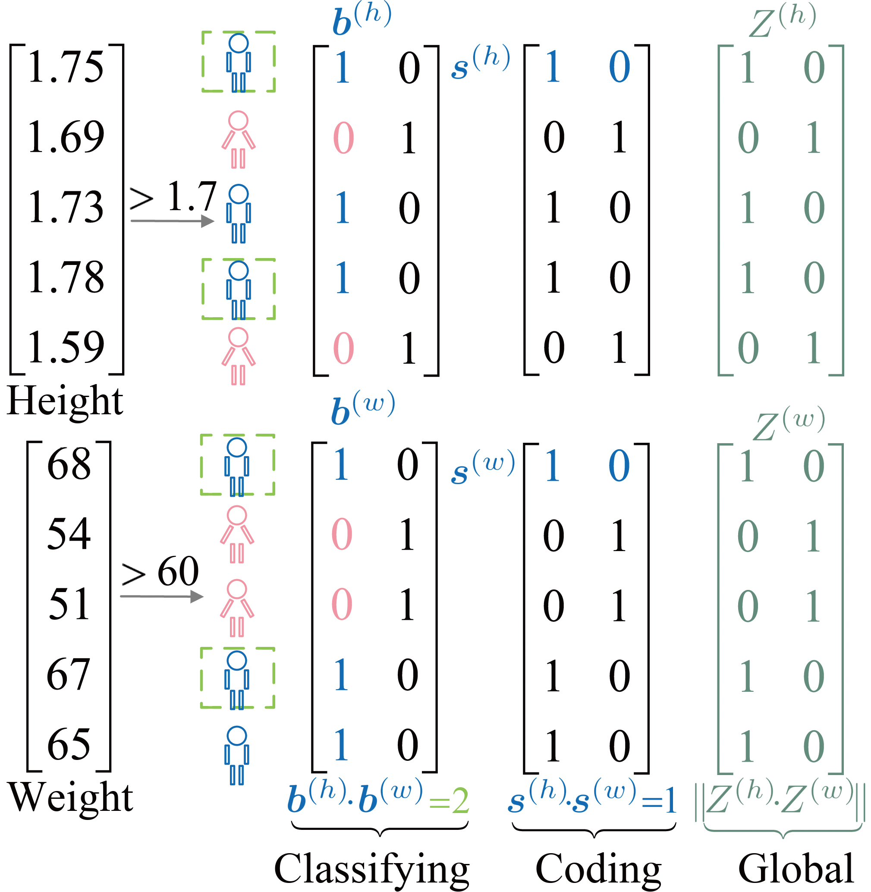
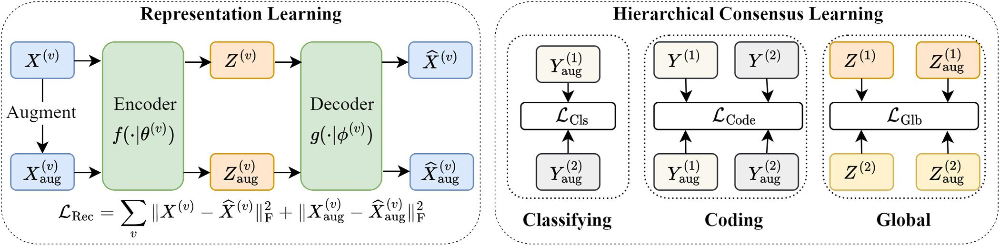

# [Hierarchical Consensus Network for Multiview Feature Learning](https://arxiv.org/abs/2502.01961)

**Abstract**: Multiview feature learning aims to learn discriminative features by integrating the distinct information in each view. However, most existing methods still face significant challenges in learning view-consistency features, which are crucial for effective multiview learning. Motivated by the theories of CCA and contrastive learning in multiview feature learning, we propose the hierarchical consensus network (HCN) in this paper. The HCN derives three consensus indices for capturing the hierarchical consensus across views, which are classifying consensus, coding consensus, and global consensus, respectively. Specifically, classifying consensus reinforces class-level correspondence between views from a CCA perspective, while coding consensus closely resembles contrastive learning and reflects contrastive comparison of individual instances. Global consensus aims to extract consensus information from two perspectives simultaneously. By enforcing the hierarchical consensus, the information within each view is better integrated to obtain more comprehensive and discriminative features. The extensive experimental results obtained on four multiview datasets demonstrate that the proposed method significantly outperforms several SOTA methods.





# Experiment
This repo contains the code of a PyTorch implementation of [Hierarchical Consensus Network for Multiview Feature Learning](https://arxiv.org/abs/2502.01961)
## Installation

```bash
pip install -r requirements.txt
```

## Usage

Run the code to train and test model by:
```bash
bash final.sh
```

# Citation

We appreciate it if you cite the following paper:

```sh
@InProceedings{xia2025hierarchical,
  author    = {Chengwei Xia and Chaoxi Niu and Kun Zhan},
  booktitle = {AAAI},
  title     = {Hierarchical consensus network for multiview feature learning},
  year      = {2025},
  volume    = {39},
}
```

## Contact
https://kunzhan.github.io/

If you have any questions, feel free to contact me. (Email: `ice.echo#gmail.com`)